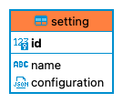

## JSON object

HoneyEQL treats `JSON` data types differently compare to the others. It performs serialization and de-serialization operations to ensure seemless data representation across Clojure (`kebab-case`) and JSON (`camel-case`)

Let's assume that we have the following schema



The `insert!` operation works like this

```clojure
(hm/insert! db-adapter 
            #:setting {:name "editor1"
                       :configuration {:tag-size 2 :font-size 14}})
;; returns (for postgres)
#:setting{:id 1,
          :name "editor1",
          :configuration #object[org.postgresql.util.PGobject 0x4782cdb3 "{\"tagSize\": 2, \"fontSize\": 14}"]}
```

As you can see from the return data, HoneyEQL automatically converted the naming convention of the JSON object's key to `camelCase` from the `kebab-case`.

While retrieving, it does the reverse

```clojure
(heql/query-single db-adapter
                   {[:setting/id 1]
                    [:setting/name
                     :setting/configuration]})
; returns
#:setting{:name "editor", :configuration {:tag-size 2, :font-size 14}}
```