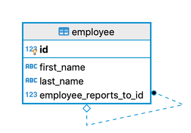

# Mutation
All the mutation operations are available under the `honeyeql.mutation` namespace

```clojure
(require '[honeyeql.mutation :as hm])
```

For the given `employee` schema, 



we can perform the following database operations using the HoneyEQL's mutation support as described.

## Insert

```clojure
;; inserting first employee
(hm/insert! db-adapter
            #:employee{:first-name "Brown"
                       :last-name "Tara"})
;; the above expression returns (for postgres)
#:employee{:id 1, :first-name "Brown", :last-name "Tara", :employee-reports-to-id nil}

;; inserting second employee
(hm/insert! db-adapter
            #:employee{:first-name "Lauryn"
                       :last-name "Mario"
                       :employee-reports-to-id 1})
;; it returns (for postgres)
#:employee{:id 2, :first-name "Lauryn", :last-name "Mario", :employee-reports-to-id 1}
```

## Insert Multiple

```clojure
(hm/insert-multi! db-adapter
            [#:employee{:first-name "Harmon"
                        :last-name "Bernie"
                        :employee-reports-to-id 1}
              #:employee{:first-name "Harold"
                        :last-name "Ambrose"
                        :employee-reports-to-id 2}
              #:employee{:first-name "Bryce"
                        :last-name "Hoeger"
                        :employee-reports-to-id 2}])

;; it returns (for postgres)
(#:employee{:id 3, :first-name "Harmon", :last-name "Bernie", :employee-reports-to-id 1}
 #:employee{:id 4, :first-name "Harold", :last-name "Ambrose", :employee-reports-to-id 2}
 #:employee{:id 5, :first-name "Bryce", :last-name "Hoeger", :employee-reports-to-id 2})

```

## Update

```clojure
;; (update! db-adapter <data-to-update> <where-condition>)
(hm/update! db-adapter
            #:employee{:first-name "Margaret"}
            #:employee{:id 1})
;; returns
#:next.jdbc{:update-count 1}

;; where-condition can have multiple attributes and it supports only the AND condition
; UPDATE employee SET last_name = 'Adam' WHERE id = 1 AND first_name 
(hm/update! db-adapter
            #:employee{:last-name "Adam"}
            #:employee{:last-name "Tara" :first-name "Margaret"})
;; returns
#:next.jdbc{:update-count 1}
```

## Delete

```clojure
;; (delete! db-adapter <where-condition>)
(hm/delete! db-adapter
            #:employee {:id 9})
;; like the where-condition in the update! function, it can have multiple attributes and it also supports only the AND condition
```

## Transaction Support

To perform Database transactions we can make use of the `next.jdbc`'s `with-transaction` [macro](https://cljdoc.org/d/com.github.seancorfield/next.jdbc/1.3.883/doc/getting-started/transactions) along with two functions, `db-spec` and `use-tx` from the `honeyeql.core` namespace.

```clojure
(jdbc/with-transaction [tx (heql/db-spec db-adapter)]
  (let [tx-aware-db-adapter (heql/use-tx db-adapter tx)]
    (hm/delete! tx-aware-db-adapter {:employee/id 10})
    (hm/delete! tx-aware-db-adapter {:employee/id 11})
    (hm/delete! tx-aware-db-adapter {:employee/id 12})))
```
